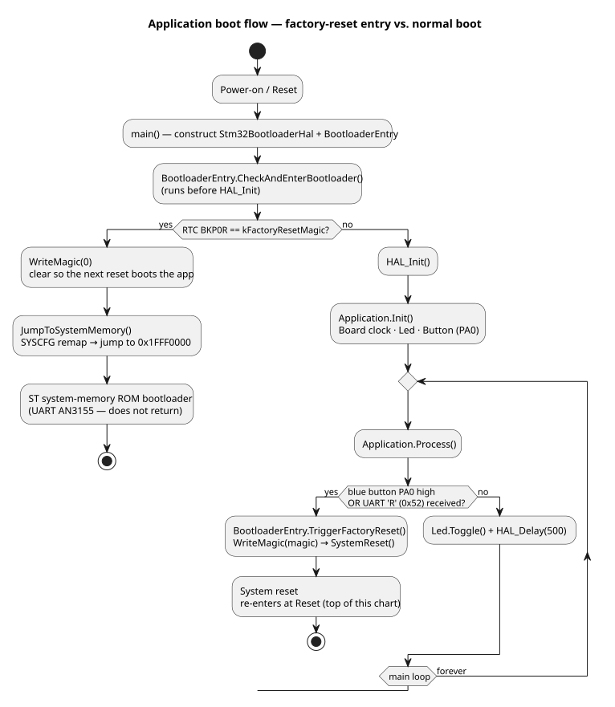
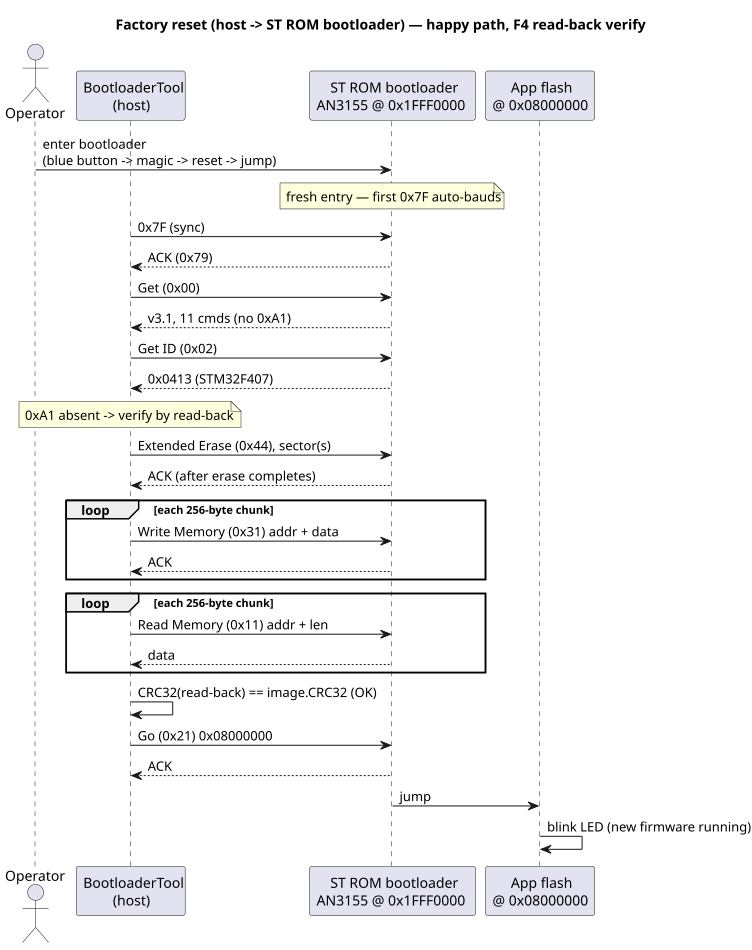
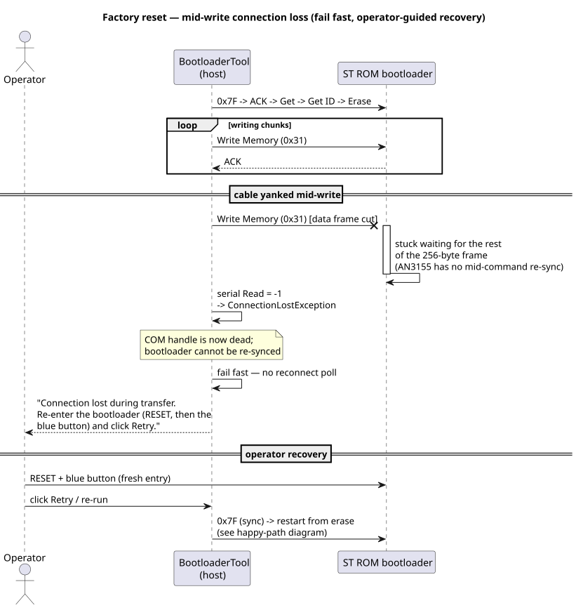

# Bootloader diagrams (Phase 7)

PlantUML sources (`*.puml`) are the versioned spec; the `*.svg` files are
generated artifacts. All three reflect behaviour validated on hardware
2026-06-16 (see `../plan.md` §10 and `../end_to_end_test.md`).

## Boot flow — factory-reset entry vs. normal boot

Reset → `BootloaderEntry::CheckAndEnterBootloader()` reads the RTC BKP0R magic
*before* `HAL_Init`: if present it clears the magic and jumps to the ST ROM
bootloader; otherwise the app runs and its loop watches the blue button (PA0)
and the UART `'R'` command, either of which arms the magic and resets.



Source: [`boot-flow.puml`](boot-flow.puml)

## Factory reset — happy path (F4 read-back verify)

Host ↔ ST ROM bootloader over UART (AN3155): sync → Get → Get ID → Extended
Erase → Write Memory → **read-back verify via Read Memory 0x11** (F4 has no
Get-Checksum 0xA1) → Go → the new firmware runs.



Source: [`factory-reset-happy.puml`](factory-reset-happy.puml)

## Factory reset — mid-write connection loss (fail fast)

A cable yank mid Write-Memory cannot be auto-recovered: the host COM handle is
dead and the bootloader is stuck mid-frame with no AN3155 re-sync. The tool
fails fast with operator guidance; recovery is a fresh entry (RESET + blue
button) plus Retry / re-run.



Source: [`factory-reset-cable-yank.puml`](factory-reset-cable-yank.puml)

## Regenerating

The `java` on PATH is Java 8, too old for the configured PlantUML jar
(needs Java 11+). Render with the per-user Temurin 21:

```sh
JAVA21="/c/Users/terry/AppData/Local/Programs/Eclipse Adoptium/jdk-21.0.11.10-hotspot/bin/java.exe"
"$JAVA21" -jar /c/plantuml/plantuml-1.2026.3.jar -tsvg *.puml
```

Note: PlantUML 1.2026.3 deprecated the `#RRGGBB:label;` activity-colour
syntax — use plain `:label;`.
